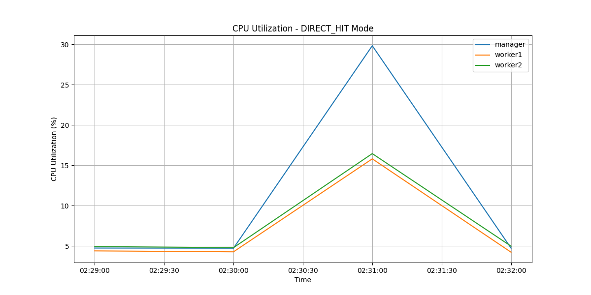
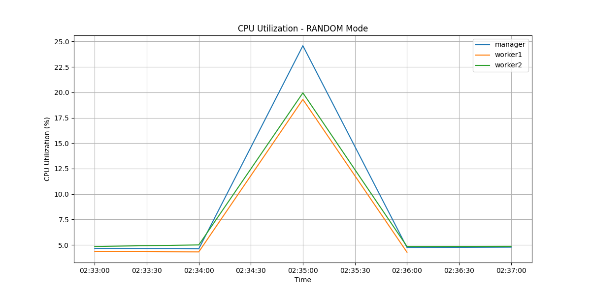
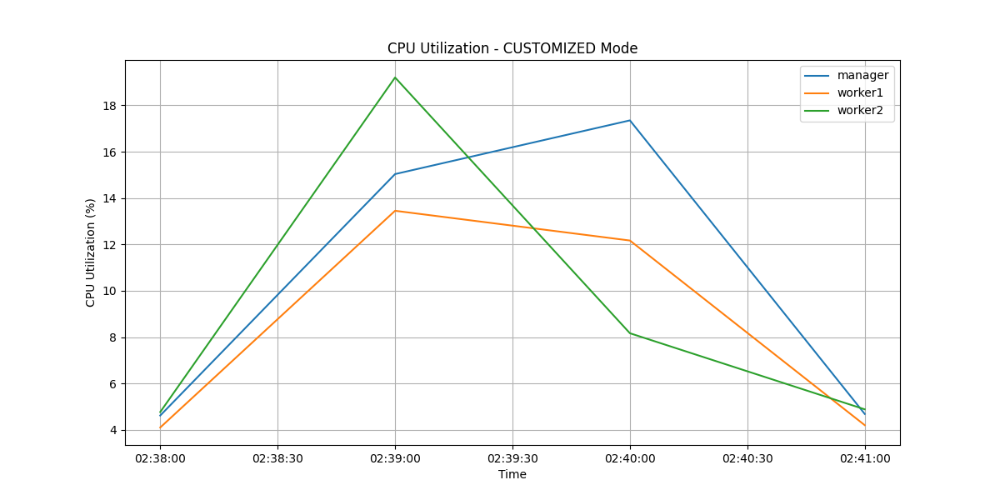

# Cloud Design Patterns: Implementing a DB Cluster

Stephen Cohen - 2412336

---
- [Cloud Design Patterns: Implementing a DB Cluster](#cloud-design-patterns-implementing-a-db-cluster)
- [Implementation Architecture and Workflow](#implementation-architecture-and-workflow)
  - [System Components](#system-components)
  - [Request Flow Process](#request-flow-process)
  - [Data Management](#data-management)
  - [Security Implementation](#security-implementation)
  - [Deployment and Management](#deployment-and-management)
- [Implementing the infrastructure](#implementing-the-infrastructure)
  - [Architecture](#architecture)
    - [VPC](#vpc)
  - [Security group](#security-group)
    - [Inbound Rules](#inbound-rules)
    - [Trusted Host](#trusted-host)
- [MySQL instances](#mysql-instances)
- [Proxy Patter Implementation](#proxy-patter-implementation)
    - [Direct Hit Mode](#direct-hit-mode)
    - [Random Mode](#random-mode)
    - [Customized Mode](#customized-mode)
- [Gatekeeper Pattern Implementation](#gatekeeper-pattern-implementation)
    - [Security Chain Implementation](#security-chain-implementation)
- [Benchmarking Analysis and Results](#benchmarking-analysis-and-results)
  - [Benchmark Methodology](#benchmark-methodology)
  - [Performance Analysis by mode](#performance-analysis-by-mode)
    - [Direct Hit Mode](#direct-hit-mode-1)
      - [Speed](#speed)
      - [CPU utilization](#cpu-utilization)
    - [Random Mode](#random-mode-1)
      - [Speed](#speed-1)
      - [CPU Utilization](#cpu-utilization-1)
    - [Customized Mode](#customized-mode-1)
      - [Speed](#speed-2)
      - [CPU Utilization](#cpu-utilization-2)
- [Conclusion](#conclusion)
- [Appendix](#appendix)
  - [Github](#github)
  - [MySQL Sysbench](#mysql-sysbench)
---

This report details the implementation of a MySQL cluster on Amazon EC2 using cloud design patterns, specifically the Proxy and Gatekeeper patterns.
All the code is available on [Github](https://github.com/Papushkado/DBCluster)

# Implementation Architecture and Workflow

## System Components

The implementation consists of a MySQL cluster managed through a secure gateway chain. The architecture includes three MySQL instances (one manager, two workers), a proxy server for load balancing, and a dual-component security gateway (Gatekeeper and Trusted Host).

## Request Flow Process

1. External requests enter through the Gatekeeper instance
2. The Gatekeeper validates and forwards requests to the Trusted Host
3. The Trusted Host verifies security and communicates with the Proxy
4. The Proxy implements three routing strategies:

   - Direct Hit: Routes all requests to the manager
   - Random: Distributes read requests randomly among workers
   - Customized: Routes based on server response times

## Data Management 

Write operations are exclusively handled by the manager node, which replicates data to worker nodes. Read operations can be distributed across workers depending on the selected proxy mode, enhancing performance through load distribution.

## Security Implementation

The system employs multiple security layers through:

- VPC isolation with specific security groups
- Gatekeeper pattern for request filtering
- IPtables rules on the Trusted Host
- Restricted communication paths between components

## Deployment and Management

Infrastructure deployment is fully automated using AWS SDK (boto3), handling VPC creation, instance deployment, security configuration, and application setup. The system includes monitoring capabilities through CloudWatch and comprehensive benchmarking functionality.


# Implementing the infrastructure

To set all, this infrastructure, you juste have to launch `main.py`

## Architecture

### VPC 

A dedicated VPC is created with proper networking:

```
vpc = self.ec2_client.create_vpc(
    CidrBlock='10.0.0.0/16',
    TagSpecifications=[{
        'ResourceType': 'vpc',
        'Tags': [{'Key': 'Name', 'Value': 'cluster-vpc'}]
    }]
)['Vpc']
```

## Security group

Each instance type has its own security group with specific inbound rules:

```
def _create_security_groups(self):
    timestamp = str(int(time.time()))
    
    # Security Group for MySQL Cluster (Manager and Workers)
    self.cluster_security_group_id = self.ec2_client.create_security_group(
        GroupName=f"common_sg_{timestamp}",
        Description="Security group for manager and workers",
        VpcId=self.vpc_id
    )['GroupId']
    
    # Security Group for Proxy
    self.proxy_security_group_id = self.ec2_client.create_security_group(
        GroupName=f"proxy_sg_{timestamp}",
        Description="Proxy security group",
        VpcId=self.vpc_id
    )['GroupId']
    
    # Security Group for Trusted Host
    self.trusted_host_security_group_id = self.ec2_client.create_security_group(
        GroupName=f"trusted_host_sg_{timestamp}",
        Description="Trusted host security group",
        VpcId=self.vpc_id
    )['GroupId']
    
    # Security Group for Gatekeeper
    self.gatekeeper_security_group_id = self.ec2_client.create_security_group(
        GroupName=f"gatekeeper_sg_{timestamp}",
        Description="Gatekeeper security group",
        VpcId=self.vpc_id
    )['GroupId']
```

### Inbound Rules 

Each security group has specific inbound rules defining allowed traffic:

```
def add_inbound_rules(self):
    # Rules for MySQL Cluster (Manager and Workers)
    self.ec2_client.authorize_security_group_ingress(
        GroupId=self.cluster_security_group_id,
        IpPermissions=[
            {
                "IpProtocol": "tcp",
                "FromPort": 22,
                "ToPort": 22,
                "IpRanges": [{"CidrIp": "0.0.0.0/0"}],  # SSH access
            },
            {
                "IpProtocol": "tcp",
                "FromPort": 5000,
                "ToPort": 5000,
                "IpRanges": [
                    {"CidrIp": f"{self.manager_instance.instance.public_ip_address}/32"},
                    {"CidrIp": f"{self.proxy_instance.instance.public_ip_address}/32"}
                ],
            },
        ],
    )

    # Rules for Trusted Host
    self.ec2_client.authorize_security_group_ingress(
        GroupId=self.trusted_host_security_group_id,
        IpPermissions=[
            {
                "IpProtocol": "tcp",
                "FromPort": 22,
                "ToPort": 22,
                "IpRanges": [{"CidrIp": "0.0.0.0/0"}],
            },
            {
                "IpProtocol": "tcp",
                "FromPort": 5000,
                "ToPort": 5000,
                "IpRanges": [{"CidrIp": f"{self.gatekeeper_instance.instance.public_ip_address}/32"}],
            },
        ],
    )
```

### Trusted Host 

The Trusted Host has additional IPtables rules for enhanced security:

- DROP all traffic by default
- Allow SSH only from Gatekeeper
- Allow application port within VPC (to convey queries)

```
def install_network_security(self):
    iptables_commands = [
        # Reset all rules
        "sudo iptables -F",
        # Default policies: DROP all traffic
        "sudo iptables -P INPUT DROP",
        "sudo iptables -P FORWARD DROP",
        "sudo iptables -P OUTPUT DROP",
        # Allow established connections
        "sudo iptables -A INPUT -m state --state ESTABLISHED,RELATED -j ACCEPT",
        "sudo iptables -A OUTPUT -m state --state ESTABLISHED,RELATED -j ACCEPT",
        # Allow SSH only from Gatekeeper
        f"sudo iptables -A INPUT -p tcp --dport 22 -s {self.gatekeeper_instance.instance.private_ip_address} -j ACCEPT",
        # Allow application port within VPC
        "sudo iptables -A INPUT -p tcp --dport 5000 -s 10.0.0.0/16 -j ACCEPT",
    ]
    
    self.execute_commands(iptables_commands, [self.trusted_host_instance])
```


# MySQL instances 

The results of the `Sysbench` benchmark on the MySQL instances is available in the appendix. (This the logs that we get)
To experimente this, you can run the code and then see the results in the "data" folder. 


# Proxy Patter Implementation

The proxy pattern is implemented with three distinct modes as required:
All of the code is available in [proxy.py](./utils/proxy.py)

### Direct Hit Mode

```
if mode == "DIRECT_HIT":
    url = f"http://{public_ips['manager']}:5000/query"
    response = requests.post(url, json={"query": query})
    response_data = {}
    response_data["handled_by"] = "manager"
    response_data["result"] = response.json()
    return jsonify(response_data), response.status_code
```

### Random Mode

```
elif mode == "RANDOM":
    target = random.choice(list(public_ips))
    ip = public_ips[target]
    url = f"http://{ip}:5000/query"
    response = requests.post(url, json={"query": query})
    response_data = {}
    response_data["handled_by"] = target
    response_data["result"] = response.json()
    return jsonify(response_data), response.status_code
```

In random mode:

- READ requests are randomly distributed among workers
- Write operations still go to the manager
- Provides basic load balancing

### Customized Mode 

```
elif mode == "CUSTOMIZED":
    ping = {}
    for key, ip in public_ips.items():
        if key.startswith("proxy"):
            continue
        try:
            start_time = time.time()
            requests.get(f"http://{ip}:5000/", timeout=2)
            ping[key] = time.time() - start_time
        except requests.exceptions.RequestException:
            ping[key] = float("inf")
```

# Gatekeeper Pattern Implementation 

All the code is available in the [gatekeeper script](./utils/gatekeeper.py)

### Security Chain Implementation 

```
@app.route("/query", methods=["POST"])
def query():
    try:
        data = request.json
        query = data.get("query")

        if not query:
            return jsonify({"error": "No query provided"}), 400

        url = f"http://{trusted_host_ip}:5000/query"
        response = requests.post(url, json={"query": query})
        return jsonify(response.json()), response.status_code
```
---
# Benchmarking Analysis and Results

## Benchmark Methodology

The benchmarking process was implemented using a comprehensive approach that tests each proxy mode (DIRECT_HIT, RANDOM, and CUSTOMIZED) with 1000 read and write requests. CPU utilization was monitored through CloudWatch metrics, capturing data points every 20 seconds to provide detailed performance insights.

All the code is available in the [benchmark code](./benchmark.py)

## Performance Analysis by mode

### Direct Hit Mode

#### Speed

Here are the results of the benchmark : 

```
Read requests: {'avg_time': 0.07581605505943298, 'success_rate': 100.0}
Write requests: {'avg_time': 0.1200225088596344, 'success_rate': 100.0}
```
#### CPU utilization 

In DIRECT_HIT mode, the manager node shows significantly higher CPU utilization (peaking at 30%) compared to workers (maximum 15%). 
**This is expected as all requests are routed to the manager node.** The workers show minimal activity, primarily from background processes and data replication.



### Random Mode 

#### Speed

Here are the results of the benchmark : 

```
Read requests: {'avg_time': 0.08405190014839173, 'success_rate': 100.0}
Write requests: {'avg_time': 0.1335366222858429, 'success_rate': 100.0}
```

#### CPU Utilization

The RANDOM mode demonstrates **more balanced resource utilization**:

- Manager node peaks at 25%
- Workers show consistent activity around 20%
- Load distribution is more even compared to Direct Hit
- Clear pattern of distributed read operations



### Customized Mode

#### Speed

Here are the results of the benchmark : 

```
Read requests: {'avg_time': 0.09927887964248658, 'success_rate': 100.0}
Write requests: {'avg_time': 0.12237462043762207, 'success_rate': 100.0}
```

#### CPU Utilization

The CUSTOMIZED mode shows **the most efficient resource utilization**:

- Lower peak CPU usage (maximum 19% for worker2)
- More stable performance curves
- Better load distribution across all nodes
- Manager node maintains steady performance at 17%



# Conclusion

Based on the analysis of the three proxy modes (Direct Hit, Random, and Customized), we can draw several important conclusions about their performance and efficiency:
- _The Direct Hit mode_ demonstrated the fastest average response times for read operations (0.075s) but created a noticeable bottleneck at the manager node, with CPU utilization reaching 30%. While this approach is simple to implement, it doesn't effectively utilize the cluster's distributed capabilities.
- The _Random mode_ showed a more balanced workload distribution across nodes, with CPU utilization more evenly spread (around 20-25% across nodes). However, it resulted in slightly slower response times (0.084s for reads), likely due to the overhead of random distribution.
- The _Customized mode_, while having the slowest average read times (0.099s), achieved the most efficient and stable resource utilization pattern. It maintained CPU usage below 19% across all nodes and showed the most consistent performance curves, indicating better long-term stability and scalability potential.

All three modes maintained 100% success rates for both read and write operations, demonstrating the robustness of the implementation. However, the results suggest different optimal use cases:

- _Direct Hit mode_ is suitable for scenarios **prioritizing raw speed over resource efficiency**
- _Random mode_ offers a **good balance between performance and resource distribution**
- _Customized mode_ is ideal for scenarios requiring **stable, predictable performance and optimal resource utilization**

For production environments, the Customized mode would be the recommended choice despite its slightly slower response times, as it provides the best balance of resource utilization, system stability, and scalability potential.


# Appendix

## Github

All the code is available on [Github](https://github.com/Papushkado/DBCluster)

## MySQL Sysbench

Here are the logs : 

```
[Running] python -u "c:\Users\Stephen\Documents\1_Etudes\Montreal\LOG8145 - Cloud Computing\DBCluster\main.py"
Created key pair and saved to mysql-cluster-key.pem
Created VPC: vpc-0e2dbca33378a5037
Created Subnet: subnet-0ac2309f3e71b4512
Created Security Groups
Created EC2 Instances

Waiting for instances to initialize before running Sysbench tests...

Testing MySQL-Manager (34.206.52.162)

Executing: sudo apt-get update
Hit:1 http://us-east-1.ec2.archive.ubuntu.com/ubuntu focal InRelease
Hit:2 http://security.ubuntu.com/ubuntu focal-security InRelease
Hit:3 http://us-east-1.ec2.archive.ubuntu.com/ubuntu focal-updates InRelease
Hit:4 http://us-east-1.ec2.archive.ubuntu.com/ubuntu focal-backports InRelease
Reading package lists...


Executing: sudo apt-get install -y sysbench
Reading package lists...
Building dependency tree...
Reading state information...
The following additional packages will be installed:
  libluajit-5.1-2 libluajit-5.1-common libmysqlclient21 libpq5
The following NEW packages will be installed:
  libluajit-5.1-2 libluajit-5.1-common libmysqlclient21 libpq5 sysbench
0 upgraded, 5 newly installed, 0 to remove and 182 not upgraded.
Need to get 1800 kB of archives.
After this operation, 9051 kB of additional disk space will be used.
Get:1 http://us-east-1.ec2.archive.ubuntu.com/ubuntu focal/universe amd64 libluajit-5.1-common all 2.1.0~beta3+dfsg-5.1build1 [44.3 kB]
Get:2 http://us-east-1.ec2.archive.ubuntu.com/ubuntu focal/universe amd64 libluajit-5.1-2 amd64 2.1.0~beta3+dfsg-5.1build1 [228 kB]
Get:3 http://us-east-1.ec2.archive.ubuntu.com/ubuntu focal-updates/main amd64 libmysqlclient21 amd64 8.0.40-0ubuntu0.20.04.1 [1304 kB]
Get:4 http://us-east-1.ec2.archive.ubuntu.com/ubuntu focal-updates/main amd64 libpq5 amd64 12.20-0ubuntu0.20.04.1 [117 kB]
Get:5 http://us-east-1.ec2.archive.ubuntu.com/ubuntu focal/universe amd64 sysbench amd64 1.0.18+ds-1 [107 kB]
Fetched 1800 kB in 0s (37.5 MB/s)
Selecting previously unselected package libluajit-5.1-common.

(Reading database ... 
(Reading database ... 5%
(Reading database ... 10%
(Reading database ... 15%
(Reading database ... 20%
(Reading database ... 25%
(Reading database ... 30%
(Reading database ... 35%
(Reading database ... 40%
(Reading database ... 45%
(Reading database ... 50%
(Reading database ... 55%
(Reading database ... 60%
(Reading database ... 65%
(Reading database ... 70%
(Reading database ... 75%
(Reading database ... 80%
(Reading database ... 85%
(Reading database ... 90%
(Reading database ... 95%
(Reading database ... 100%
(Reading database ... 62513 files and directories currently installed.)

Preparing to unpack .../libluajit-5.1-common_2.1.0~beta3+dfsg-5.1build1_all.deb ...

Unpacking libluajit-5.1-common (2.1.0~beta3+dfsg-5.1build1) ...

Selecting previously unselected package libluajit-5.1-2:amd64.

Preparing to unpack .../libluajit-5.1-2_2.1.0~beta3+dfsg-5.1build1_amd64.deb ...

Unpacking libluajit-5.1-2:amd64 (2.1.0~beta3+dfsg-5.1build1) ...

Selecting previously unselected package libmysqlclient21:amd64.

Preparing to unpack .../libmysqlclient21_8.0.40-0ubuntu0.20.04.1_amd64.deb ...

Unpacking libmysqlclient21:amd64 (8.0.40-0ubuntu0.20.04.1) ...

Selecting previously unselected package libpq5:amd64.

Preparing to unpack .../libpq5_12.20-0ubuntu0.20.04.1_amd64.deb ...

Unpacking libpq5:amd64 (12.20-0ubuntu0.20.04.1) ...

Selecting previously unselected package sysbench.

Preparing to unpack .../sysbench_1.0.18+ds-1_amd64.deb ...

Unpacking sysbench (1.0.18+ds-1) ...

Setting up libmysqlclient21:amd64 (8.0.40-0ubuntu0.20.04.1) ...

Setting up libpq5:amd64 (12.20-0ubuntu0.20.04.1) ...

Setting up libluajit-5.1-common (2.1.0~beta3+dfsg-5.1build1) ...

Setting up libluajit-5.1-2:amd64 (2.1.0~beta3+dfsg-5.1build1) ...

Setting up sysbench (1.0.18+ds-1) ...

Processing triggers for man-db (2.9.1-1) ...

Processing triggers for libc-bin (2.31-0ubuntu9.9) ...


debconf: unable to initialize frontend: Dialog
debconf: (Dialog frontend will not work on a dumb terminal, an emacs shell buffer, or without a controlling terminal.)
debconf: falling back to frontend: Readline
debconf: unable to initialize frontend: Readline
debconf: (This frontend requires a controlling tty.)
debconf: falling back to frontend: Teletype
dpkg-preconfigure: unable to re-open stdin: 


Executing: mysql -uroot -proot_password -e 'CREATE DATABASE IF NOT EXISTS sbtest;'

mysql: [Warning] Using a password on the command line interface can be insecure.


Executing: sysbench --db-driver=mysql --mysql-user=root --mysql-password=root_password --mysql-db=sbtest --table-size=10000 --tables=3 /usr/share/sysbench/oltp_read_write.lua prepare
sysbench 1.0.18 (using system LuaJIT 2.1.0-beta3)

Creating table 'sbtest1'...
Inserting 10000 records into 'sbtest1'
Creating a secondary index on 'sbtest1'...
Creating table 'sbtest2'...
Inserting 10000 records into 'sbtest2'
Creating a secondary index on 'sbtest2'...
Creating table 'sbtest3'...
Inserting 10000 records into 'sbtest3'
Creating a secondary index on 'sbtest3'...


Executing: sysbench --db-driver=mysql --mysql-user=root --mysql-password=root_password --mysql-db=sbtest --table-size=10000 --tables=3 --threads=6 --time=60 --report-interval=10 /usr/share/sysbench/oltp_read_write.lua run
sysbench 1.0.18 (using system LuaJIT 2.1.0-beta3)

Running the test with following options:
Number of threads: 6
Report intermediate results every 10 second(s)
Initializing random number generator from current time


Initializing worker threads...

Threads started!

[ 10s ] thds: 6 tps: 313.01 qps: 6271.21 (r/w/o: 4390.55/1254.04/626.62) lat (ms,95%): 27.66 err/s: 0.00 reconn/s: 0.00
[ 20s ] thds: 6 tps: 319.42 qps: 6388.70 (r/w/o: 4471.81/1278.06/638.83) lat (ms,95%): 27.17 err/s: 0.00 reconn/s: 0.00
[ 30s ] thds: 6 tps: 318.51 qps: 6367.88 (r/w/o: 4457.63/1273.24/637.02) lat (ms,95%): 27.66 err/s: 0.00 reconn/s: 0.00
[ 40s ] thds: 6 tps: 318.00 qps: 6361.03 (r/w/o: 4453.32/1271.71/636.00) lat (ms,95%): 27.17 err/s: 0.00 reconn/s: 0.00
[ 50s ] thds: 6 tps: 331.00 qps: 6621.29 (r/w/o: 4634.19/1325.10/662.00) lat (ms,95%): 26.20 err/s: 0.00 reconn/s: 0.00
[ 60s ] thds: 6 tps: 327.00 qps: 6537.02 (r/w/o: 4576.92/1306.10/654.00) lat (ms,95%): 26.68 err/s: 0.00 reconn/s: 0.00
SQL statistics:
    queries performed:
        read:                            269864
        write:                           77104
        other:                           38552
        total:                           385520
    transactions:                        19276  (321.09 per sec.)
    queries:                             385520 (6421.85 per sec.)
    ignored errors:                      0      (0.00 per sec.)
    reconnects:                          0      (0.00 per sec.)

General statistics:
    total time:                          60.0304s
    total number of events:              19276

Latency (ms):
         min:                                    3.74
         avg:                                   18.68
         max:                                   73.45
         95th percentile:                       27.17
         sum:                               360035.04

Threads fairness:
    events (avg/stddev):           3212.6667/22.69
    execution time (avg/stddev):   60.0058/0.01


Executing: sysbench --db-driver=mysql --mysql-user=root --mysql-password=root_password --mysql-db=sbtest --table-size=10000 --tables=3 /usr/share/sysbench/oltp_read_write.lua cleanup
sysbench 1.0.18 (using system LuaJIT 2.1.0-beta3)

Dropping table 'sbtest1'...
Dropping table 'sbtest2'...
Dropping table 'sbtest3'...


Testing MySQL-Worker-1 (3.236.166.73)

Executing: sudo apt-get update
Hit:1 http://us-east-1.ec2.archive.ubuntu.com/ubuntu focal InRelease
Hit:2 http://us-east-1.ec2.archive.ubuntu.com/ubuntu focal-updates InRelease
Hit:3 http://us-east-1.ec2.archive.ubuntu.com/ubuntu focal-backports InRelease
Hit:4 http://security.ubuntu.com/ubuntu focal-security InRelease
Reading package lists...


Executing: sudo apt-get install -y sysbench
Reading package lists...
Building dependency tree...
Reading state information...
The following additional packages will be installed:
  libluajit-5.1-2 libluajit-5.1-common libmysqlclient21 libpq5
The following NEW packages will be installed:
  libluajit-5.1-2 libluajit-5.1-common libmysqlclient21 libpq5 sysbench
0 upgraded, 5 newly installed, 0 to remove and 182 not upgraded.
Need to get 1800 kB of archives.
After this operation, 9051 kB of additional disk space will be used.
Get:1 http://us-east-1.ec2.archive.ubuntu.com/ubuntu focal/universe amd64 libluajit-5.1-common all 2.1.0~beta3+dfsg-5.1build1 [44.3 kB]
Get:2 http://us-east-1.ec2.archive.ubuntu.com/ubuntu focal/universe amd64 libluajit-5.1-2 amd64 2.1.0~beta3+dfsg-5.1build1 [228 kB]
Get:3 http://us-east-1.ec2.archive.ubuntu.com/ubuntu focal-updates/main amd64 libmysqlclient21 amd64 8.0.40-0ubuntu0.20.04.1 [1304 kB]
Get:4 http://us-east-1.ec2.archive.ubuntu.com/ubuntu focal-updates/main amd64 libpq5 amd64 12.20-0ubuntu0.20.04.1 [117 kB]
Get:5 http://us-east-1.ec2.archive.ubuntu.com/ubuntu focal/universe amd64 sysbench amd64 1.0.18+ds-1 [107 kB]
Fetched 1800 kB in 0s (36.5 MB/s)
Selecting previously unselected package libluajit-5.1-common.

(Reading database ... 
(Reading database ... 5%
(Reading database ... 10%
(Reading database ... 15%
(Reading database ... 20%
(Reading database ... 25%
(Reading database ... 30%
(Reading database ... 35%
(Reading database ... 40%
(Reading database ... 45%
(Reading database ... 50%
(Reading database ... 55%
(Reading database ... 60%
(Reading database ... 65%
(Reading database ... 70%
(Reading database ... 75%
(Reading database ... 80%
(Reading database ... 85%
(Reading database ... 90%
(Reading database ... 95%
(Reading database ... 100%
(Reading database ... 62513 files and directories currently installed.)

Preparing to unpack .../libluajit-5.1-common_2.1.0~beta3+dfsg-5.1build1_all.deb ...

Unpacking libluajit-5.1-common (2.1.0~beta3+dfsg-5.1build1) ...

Selecting previously unselected package libluajit-5.1-2:amd64.

Preparing to unpack .../libluajit-5.1-2_2.1.0~beta3+dfsg-5.1build1_amd64.deb ...

Unpacking libluajit-5.1-2:amd64 (2.1.0~beta3+dfsg-5.1build1) ...

Selecting previously unselected package libmysqlclient21:amd64.

Preparing to unpack .../libmysqlclient21_8.0.40-0ubuntu0.20.04.1_amd64.deb ...

Unpacking libmysqlclient21:amd64 (8.0.40-0ubuntu0.20.04.1) ...

Selecting previously unselected package libpq5:amd64.

Preparing to unpack .../libpq5_12.20-0ubuntu0.20.04.1_amd64.deb ...

Unpacking libpq5:amd64 (12.20-0ubuntu0.20.04.1) ...

Selecting previously unselected package sysbench.

Preparing to unpack .../sysbench_1.0.18+ds-1_amd64.deb ...

Unpacking sysbench (1.0.18+ds-1) ...

Setting up libmysqlclient21:amd64 (8.0.40-0ubuntu0.20.04.1) ...

Setting up libpq5:amd64 (12.20-0ubuntu0.20.04.1) ...

Setting up libluajit-5.1-common (2.1.0~beta3+dfsg-5.1build1) ...

Setting up libluajit-5.1-2:amd64 (2.1.0~beta3+dfsg-5.1build1) ...

Setting up sysbench (1.0.18+ds-1) ...

Processing triggers for man-db (2.9.1-1) ...

Processing triggers for libc-bin (2.31-0ubuntu9.9) ...


debconf: unable to initialize frontend: Dialog
debconf: (Dialog frontend will not work on a dumb terminal, an emacs shell buffer, or without a controlling terminal.)
debconf: falling back to frontend: Readline
debconf: unable to initialize frontend: Readline
debconf: (This frontend requires a controlling tty.)
debconf: falling back to frontend: Teletype
dpkg-preconfigure: unable to re-open stdin: 


Executing: mysql -uroot -proot_password -e 'CREATE DATABASE IF NOT EXISTS sbtest;'

mysql: [Warning] Using a password on the command line interface can be insecure.


Executing: sysbench --db-driver=mysql --mysql-user=root --mysql-password=root_password --mysql-db=sbtest --table-size=10000 --tables=3 /usr/share/sysbench/oltp_read_write.lua prepare
sysbench 1.0.18 (using system LuaJIT 2.1.0-beta3)

Creating table 'sbtest1'...
Inserting 10000 records into 'sbtest1'
Creating a secondary index on 'sbtest1'...
Creating table 'sbtest2'...
Inserting 10000 records into 'sbtest2'
Creating a secondary index on 'sbtest2'...
Creating table 'sbtest3'...
Inserting 10000 records into 'sbtest3'
Creating a secondary index on 'sbtest3'...


Executing: sysbench --db-driver=mysql --mysql-user=root --mysql-password=root_password --mysql-db=sbtest --table-size=10000 --tables=3 --threads=6 --time=60 --report-interval=10 /usr/share/sysbench/oltp_read_write.lua run
sysbench 1.0.18 (using system LuaJIT 2.1.0-beta3)

Running the test with following options:
Number of threads: 6
Report intermediate results every 10 second(s)
Initializing random number generator from current time


Initializing worker threads...

Threads started!

[ 10s ] thds: 6 tps: 312.12 qps: 6253.89 (r/w/o: 4378.14/1250.90/624.85) lat (ms,95%): 28.16 err/s: 0.00 reconn/s: 0.00
[ 20s ] thds: 6 tps: 323.20 qps: 6463.98 (r/w/o: 4524.79/1292.80/646.40) lat (ms,95%): 26.68 err/s: 0.00 reconn/s: 0.00
[ 30s ] thds: 6 tps: 323.51 qps: 6467.57 (r/w/o: 4527.89/1292.65/647.03) lat (ms,95%): 27.17 err/s: 0.00 reconn/s: 0.00
[ 40s ] thds: 6 tps: 318.78 qps: 6377.91 (r/w/o: 4464.16/1276.20/637.55) lat (ms,95%): 28.67 err/s: 0.00 reconn/s: 0.00
[ 50s ] thds: 6 tps: 324.64 qps: 6489.75 (r/w/o: 4543.02/1297.45/649.27) lat (ms,95%): 26.68 err/s: 0.00 reconn/s: 0.00
[ 60s ] thds: 6 tps: 328.90 qps: 6578.51 (r/w/o: 4605.01/1315.80/657.70) lat (ms,95%): 26.20 err/s: 0.00 reconn/s: 0.00
SQL statistics:
    queries performed:
        read:                            270438
        write:                           77268
        other:                           38634
        total:                           386340
    transactions:                        19317  (321.84 per sec.)
    queries:                             386340 (6436.83 per sec.)
    ignored errors:                      0      (0.00 per sec.)
    reconnects:                          0      (0.00 per sec.)

General statistics:
    total time:                          60.0182s
    total number of events:              19317

Latency (ms):
         min:                                    6.93
         avg:                                   18.64
         max:                                   59.15
         95th percentile:                       27.17
         sum:                               359989.12

Threads fairness:
    events (avg/stddev):           3219.5000/7.14
    execution time (avg/stddev):   59.9982/0.01


Executing: sysbench --db-driver=mysql --mysql-user=root --mysql-password=root_password --mysql-db=sbtest --table-size=10000 --tables=3 /usr/share/sysbench/oltp_read_write.lua cleanup
sysbench 1.0.18 (using system LuaJIT 2.1.0-beta3)

Dropping table 'sbtest1'...
Dropping table 'sbtest2'...
Dropping table 'sbtest3'...


Testing MySQL-Worker-2 (3.223.127.57)

Executing: sudo apt-get update
Hit:1 http://us-east-1.ec2.archive.ubuntu.com/ubuntu focal InRelease
Hit:2 http://us-east-1.ec2.archive.ubuntu.com/ubuntu focal-updates InRelease
Hit:3 http://us-east-1.ec2.archive.ubuntu.com/ubuntu focal-backports InRelease
Hit:4 http://security.ubuntu.com/ubuntu focal-security InRelease
Reading package lists...


Executing: sudo apt-get install -y sysbench
Reading package lists...
Building dependency tree...
Reading state information...
The following additional packages will be installed:
  libluajit-5.1-2 libluajit-5.1-common libmysqlclient21 libpq5
The following NEW packages will be installed:
  libluajit-5.1-2 libluajit-5.1-common libmysqlclient21 libpq5 sysbench
0 upgraded, 5 newly installed, 0 to remove and 182 not upgraded.
Need to get 1800 kB of archives.
After this operation, 9051 kB of additional disk space will be used.
Get:1 http://us-east-1.ec2.archive.ubuntu.com/ubuntu focal/universe amd64 libluajit-5.1-common all 2.1.0~beta3+dfsg-5.1build1 [44.3 kB]
Get:2 http://us-east-1.ec2.archive.ubuntu.com/ubuntu focal/universe amd64 libluajit-5.1-2 amd64 2.1.0~beta3+dfsg-5.1build1 [228 kB]
Get:3 http://us-east-1.ec2.archive.ubuntu.com/ubuntu focal-updates/main amd64 libmysqlclient21 amd64 8.0.40-0ubuntu0.20.04.1 [1304 kB]
Get:4 http://us-east-1.ec2.archive.ubuntu.com/ubuntu focal-updates/main amd64 libpq5 amd64 12.20-0ubuntu0.20.04.1 [117 kB]
Get:5 http://us-east-1.ec2.archive.ubuntu.com/ubuntu focal/universe amd64 sysbench amd64 1.0.18+ds-1 [107 kB]
Fetched 1800 kB in 0s (36.1 MB/s)
Selecting previously unselected package libluajit-5.1-common.

(Reading database ... 
(Reading database ... 5%
(Reading database ... 10%
(Reading database ... 15%
(Reading database ... 20%
(Reading database ... 25%
(Reading database ... 30%
(Reading database ... 35%
(Reading database ... 40%
(Reading database ... 45%
(Reading database ... 50%
(Reading database ... 55%
(Reading database ... 60%
(Reading database ... 65%
(Reading database ... 70%
(Reading database ... 75%
(Reading database ... 80%
(Reading database ... 85%
(Reading database ... 90%
(Reading database ... 95%
(Reading database ... 100%
(Reading database ... 62513 files and directories currently installed.)

Preparing to unpack .../libluajit-5.1-common_2.1.0~beta3+dfsg-5.1build1_all.deb ...

Unpacking libluajit-5.1-common (2.1.0~beta3+dfsg-5.1build1) ...

Selecting previously unselected package libluajit-5.1-2:amd64.

Preparing to unpack .../libluajit-5.1-2_2.1.0~beta3+dfsg-5.1build1_amd64.deb ...

Unpacking libluajit-5.1-2:amd64 (2.1.0~beta3+dfsg-5.1build1) ...

Selecting previously unselected package libmysqlclient21:amd64.

Preparing to unpack .../libmysqlclient21_8.0.40-0ubuntu0.20.04.1_amd64.deb ...

Unpacking libmysqlclient21:amd64 (8.0.40-0ubuntu0.20.04.1) ...

Selecting previously unselected package libpq5:amd64.

Preparing to unpack .../libpq5_12.20-0ubuntu0.20.04.1_amd64.deb ...

Unpacking libpq5:amd64 (12.20-0ubuntu0.20.04.1) ...

Selecting previously unselected package sysbench.

Preparing to unpack .../sysbench_1.0.18+ds-1_amd64.deb ...

Unpacking sysbench (1.0.18+ds-1) ...

Setting up libmysqlclient21:amd64 (8.0.40-0ubuntu0.20.04.1) ...

Setting up libpq5:amd64 (12.20-0ubuntu0.20.04.1) ...

Setting up libluajit-5.1-common (2.1.0~beta3+dfsg-5.1build1) ...

Setting up libluajit-5.1-2:amd64 (2.1.0~beta3+dfsg-5.1build1) ...

Setting up sysbench (1.0.18+ds-1) ...

Processing triggers for man-db (2.9.1-1) ...

Processing triggers for libc-bin (2.31-0ubuntu9.9) ...


debconf: unable to initialize frontend: Dialog
debconf: (Dialog frontend will not work on a dumb terminal, an emacs shell buffer, or without a controlling terminal.)
debconf: falling back to frontend: Readline
debconf: unable to initialize frontend: Readline
debconf: (This frontend requires a controlling tty.)
debconf: falling back to frontend: Teletype
dpkg-preconfigure: unable to re-open stdin: 


Executing: mysql -uroot -proot_password -e 'CREATE DATABASE IF NOT EXISTS sbtest;'

mysql: [Warning] Using a password on the command line interface can be insecure.


Executing: sysbench --db-driver=mysql --mysql-user=root --mysql-password=root_password --mysql-db=sbtest --table-size=10000 --tables=3 /usr/share/sysbench/oltp_read_write.lua prepare
sysbench 1.0.18 (using system LuaJIT 2.1.0-beta3)

Creating table 'sbtest1'...
Inserting 10000 records into 'sbtest1'
Creating a secondary index on 'sbtest1'...
Creating table 'sbtest2'...
Inserting 10000 records into 'sbtest2'
Creating a secondary index on 'sbtest2'...
Creating table 'sbtest3'...
Inserting 10000 records into 'sbtest3'
Creating a secondary index on 'sbtest3'...


Executing: sysbench --db-driver=mysql --mysql-user=root --mysql-password=root_password --mysql-db=sbtest --table-size=10000 --tables=3 --threads=6 --time=60 --report-interval=10 /usr/share/sysbench/oltp_read_write.lua run
sysbench 1.0.18 (using system LuaJIT 2.1.0-beta3)

Running the test with following options:
Number of threads: 6
Report intermediate results every 10 second(s)
Initializing random number generator from current time


Initializing worker threads...

Threads started!

[ 10s ] thds: 6 tps: 313.24 qps: 6276.26 (r/w/o: 4393.80/1255.37/627.09) lat (ms,95%): 28.16 err/s: 0.00 reconn/s: 0.00
[ 20s ] thds: 6 tps: 231.51 qps: 4629.91 (r/w/o: 3241.08/925.82/463.01) lat (ms,95%): 52.89 err/s: 0.00 reconn/s: 0.00
[ 30s ] thds: 6 tps: 287.00 qps: 5737.89 (r/w/o: 4016.89/1147.00/574.00) lat (ms,95%): 37.56 err/s: 0.00 reconn/s: 0.00
[ 40s ] thds: 6 tps: 324.20 qps: 6486.27 (r/w/o: 4539.88/1297.99/648.40) lat (ms,95%): 26.68 err/s: 0.00 reconn/s: 0.00
[ 50s ] thds: 6 tps: 125.10 qps: 2498.71 (r/w/o: 1749.71/498.80/250.20) lat (ms,95%): 189.93 err/s: 0.00 reconn/s: 0.00
[ 60s ] thds: 6 tps: 308.69 qps: 6177.14 (r/w/o: 4323.39/1236.37/617.38) lat (ms,95%): 31.94 err/s: 0.00 reconn/s: 0.00
SQL statistics:
    queries performed:
        read:                            222656
        write:                           63616
        other:                           31808
        total:                           318080
    transactions:                        15904  (264.98 per sec.)
    queries:                             318080 (5299.56 per sec.)
    ignored errors:                      0      (0.00 per sec.)
    reconnects:                          0      (0.00 per sec.)

General statistics:
    total time:                          60.0187s
    total number of events:              15904

Latency (ms):
         min:                                    4.59
         avg:                                   22.64
         max:                                  705.30
         95th percentile:                       38.25
         sum:                               360023.32

Threads fairness:
    events (avg/stddev):           2650.6667/12.94
    execution time (avg/stddev):   60.0039/0.00


Executing: sysbench --db-driver=mysql --mysql-user=root --mysql-password=root_password --mysql-db=sbtest --table-size=10000 --tables=3 /usr/share/sysbench/oltp_read_write.lua cleanup
sysbench 1.0.18 (using system LuaJIT 2.1.0-beta3)

Dropping table 'sbtest1'...
Dropping table 'sbtest2'...
Dropping table 'sbtest3'...
```